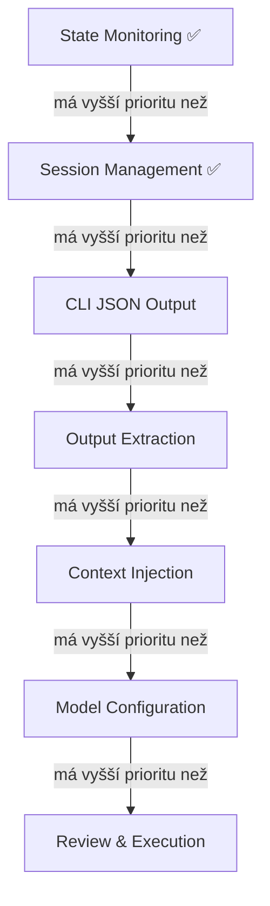

# Angrav Feature Prioritization & Work Breakdown Structure

---

## Feature Priority Graph



### Priority Relations Table

| Feature A | Relation | Feature B |
|-----------|----------|-----------|
| State Monitoring ✅ | má vyšší prioritu než | Session Management ✅ |
| Session Management ✅ | má vyšší prioritu než | CLI JSON Output |
| CLI JSON Output | má vyšší prioritu než | Output Extraction |
| Output Extraction | má vyšší prioritu než | Context Injection |
| Context Injection | má vyšší prioritu než | Model Configuration |
| Model Configuration | má vyšší prioritu než | Review & Execution |

### Rationale
1. **State Monitoring** (done) – Foundation for all interactions
2. **Session Management** (done) – Control conversation lifecycle
3. **CLI JSON Output** – Required for AI agents to parse responses
4. **Output Extraction** – AI needs to read agent's code/answers
5. **Context Injection** – AI feeds files to agent
6. **Model Configuration** – Optimize for task complexity
7. **Review & Execution** – Advanced control, most complex selectors

---

## Work Breakdown Structure (WBS)

### Legend
- **Min**: Best case (selectors work first try, no debugging)
- **Anticipated**: Realistic (some selector tweaking, minor issues)
- **Max**: Worst case (significant DOM changes, debugging needed)
- **Complexity**: 1-5 scale (1=trivial, 5=complex)

---

### Phase 0: Already Completed ✅

| Task | Status | Notes |
|------|--------|-------|
| 0.1 State Monitoring | ✅ Done | `src/state.ts` |
| 0.2 Session Management | ✅ Done | `src/session.ts` |

---

### Phase 1: CLI JSON Output

**Goal**: Add `--json` flag to all CLI commands for machine-readable output.

| ID | Task | Min | Anticipated | Max | Complexity | Tools |
|----|------|-----|-------------|-----|------------|-------|
| 1.1 | Refactor CLI output helpers | 15min | 30min | 1h | 2 | TypeScript |
| 1.2 | Add `--json` to `status` command | 10min | 20min | 30min | 1 | commander.js |
| 1.3 | Add `--json` to `wait` command | 10min | 20min | 30min | 1 | commander.js |
| 1.4 | Add `--json` to `session new` | 10min | 20min | 30min | 1 | commander.js |
| 1.5 | Add `--json` to `session history` | 15min | 30min | 45min | 2 | commander.js |
| 1.6 | Define output schemas (types) | 20min | 40min | 1h | 2 | TypeScript |
| 1.7 | Write tests for JSON output | 20min | 40min | 1h | 2 | Playwright |
| 1.8 | Update docs | 15min | 30min | 45min | 1 | Markdown |
| **Total Phase 1** | **1h 55min** | **3h 50min** | **5h 40min** | | |

---

### Phase 2: Output Extraction

**Goal**: Extract code blocks, thoughts, and final answers from agent responses.

| ID | Task | Min | Anticipated | Max | Complexity | Tools |
|----|------|-----|-------------|-----|------------|-------|
| 2.1 | Analyze DOM for code blocks | 30min | 1h | 2h | 3 | Browser DevTools, HTML dump |
| 2.2 | Implement `extractCodeBlocks()` | 30min | 1h | 2h | 3 | Playwright, TypeScript |
| 2.3 | Implement language detection | 15min | 30min | 1h | 2 | Regex, DOM attributes |
| 2.4 | Implement `extractThoughts()` | 20min | 45min | 1.5h | 3 | Playwright (collapsible handling) |
| 2.5 | Implement `extractAnswer()` | 20min | 45min | 1.5h | 3 | Playwright |
| 2.6 | Create unified `extractResponse()` | 20min | 40min | 1h | 2 | TypeScript |
| 2.7 | Add CLI `output` command | 15min | 30min | 45min | 2 | commander.js |
| 2.8 | Add `--json` output | 10min | 20min | 30min | 1 | TypeScript |
| 2.9 | Write tests | 30min | 1h | 2h | 3 | Playwright |
| 2.10 | Update docs | 15min | 30min | 45min | 1 | Markdown |
| **Total Phase 2** | **3h 25min** | **6h 50min** | **13h** | | |

---

### Phase 3: Context Injection

**Goal**: Programmatically add file references and upload documents.

| ID | Task | Min | Anticipated | Max | Complexity | Tools |
|----|------|-----|-------------|-----|------------|-------|
| 3.1 | Analyze `@file` popup structure | 30min | 1h | 2h | 3 | Browser DevTools, HTML dump |
| 3.2 | Implement `addFileContext()` | 45min | 1.5h | 3h | 4 | Playwright (type, wait, select) |
| 3.3 | Handle popup item selection | 30min | 1h | 2h | 4 | Playwright (dynamic list) |
| 3.4 | Analyze "Add Context" button | 15min | 30min | 1h | 2 | Browser DevTools |
| 3.5 | Implement `uploadImage()` | 30min | 1h | 2h | 3 | Playwright (file dialog) |
| 3.6 | Implement `uploadDocument()` | 30min | 1h | 2h | 3 | Playwright (file dialog) |
| 3.7 | Add CLI `context` commands | 20min | 40min | 1h | 2 | commander.js |
| 3.8 | Write tests | 30min | 1h | 2h | 3 | Playwright |
| 3.9 | Update docs | 15min | 30min | 45min | 1 | Markdown |
| **Total Phase 3** | **4h 25min** | **8h 10min** | **15h 45min** | | |

---

### Phase 4: Model Configuration

**Goal**: Switch models and conversation modes programmatically.

| ID | Task | Min | Anticipated | Max | Complexity | Tools |
|----|------|-----|-------------|-----|------------|-------|
| 4.1 | Analyze model dropdown selectors | 20min | 45min | 1.5h | 3 | Browser DevTools |
| 4.2 | Implement `setModel()` | 20min | 45min | 1.5h | 3 | Playwright |
| 4.3 | Analyze mode dropdown selectors | 15min | 30min | 1h | 2 | Browser DevTools |
| 4.4 | Implement `setMode()` | 20min | 45min | 1.5h | 3 | Playwright |
| 4.5 | Implement `getConfig()` | 15min | 30min | 1h | 2 | Playwright |
| 4.6 | Add CLI `config` commands | 20min | 40min | 1h | 2 | commander.js |
| 4.7 | Write tests | 20min | 45min | 1.5h | 2 | Playwright |
| 4.8 | Update docs | 10min | 20min | 30min | 1 | Markdown |
| **Total Phase 4** | **2h 20min** | **5h** | **9h 30min** | | |

---

### Phase 5: Review & Execution

**Goal**: Apply code changes, undo actions, read terminal output.

| ID | Task | Min | Anticipated | Max | Complexity | Tools |
|----|------|-----|-------------|-----|------------|-------|
| 5.1 | Analyze code block action buttons | 30min | 1h | 2h | 4 | Browser DevTools |
| 5.2 | Implement `applyCodeChanges()` | 45min | 1.5h | 3h | 4 | Playwright |
| 5.3 | Implement `undoLastAction()` | 20min | 45min | 1.5h | 3 | Playwright |
| 5.4 | Research xterm reading strategy | 30min | 1h | 2h | 4 | xterm.js docs, DevTools |
| 5.5 | Implement `readTerminal()` | 45min | 1.5h | 3h | 5 | Playwright, accessibility tree |
| 5.6 | Add CLI `apply`, `undo`, `terminal` | 20min | 45min | 1h | 2 | commander.js |
| 5.7 | Write tests | 30min | 1h | 2h | 3 | Playwright |
| 5.8 | Update docs | 15min | 30min | 45min | 1 | Markdown |
| **Total Phase 5** | **4h 15min** | **8h** | **15h 15min** | | |

---

## Summary

| Phase | Feature | Min | Anticipated | Max | Avg Complexity |
|-------|---------|-----|-------------|-----|----------------|
| 0 | State Monitoring ✅ | - | (done) | - | - |
| 0 | Session Management ✅ | - | (done) | - | - |
| 1 | CLI JSON Output | 1h 55min | 3h 50min | 5h 40min | 1.5 |
| 2 | Output Extraction | 3h 25min | 6h 50min | 13h | 2.4 |
| 3 | Context Injection | 4h 25min | 8h 10min | 15h 45min | 2.9 |
| 4 | Model Configuration | 2h 20min | 5h | 9h 30min | 2.4 |
| 5 | Review & Execution | 4h 15min | 8h | 15h 15min | 3.3 |
| **TOTAL** | | **16h 20min** | **31h 50min** | **59h 10min** | |

---

## Recommended Execution Order

```
Week 1: Phase 1 (JSON) + Phase 2 (Output)     → ~10h
Week 2: Phase 3 (Context) + Phase 4 (Config)  → ~13h
Week 3: Phase 5 (Review/Execution)            → ~8h
        + MCP Server wrap (optional)          → +6h
```

---

## Required Tools Summary

| Tool | Purpose |
|------|---------|
| **TypeScript** | Core implementation |
| **Playwright** | Browser automation, CDP connection |
| **commander.js** | CLI argument parsing |
| **Browser DevTools** | DOM analysis, selector discovery |
| **HTML dump scripts** | Offline DOM inspection |
| **Markdown** | Documentation |
