# Angrav Feature Prioritization & Work Breakdown Structure

---

## Feature Priority Graph

```mermaid
graph TD
    SM["State Monitoring ✅"]
    SESS["Session Management ✅"]
    JSON["CLI JSON Output ✅"]
    OUT["Output Extraction ✅"]
    AM["Agent Manager ✅"]
    MULTI["Multi-Session Monitoring"]
    CTX["Context Injection"]
    CFG["Model Configuration"]
    REV["Review & Execution"]

    SM -->|"higher priority"| SESS
    SESS -->|"higher priority"| JSON
    JSON -->|"higher priority"| OUT
    OUT -->|"higher priority"| AM
    AM -->|"higher priority"| MULTI
    MULTI -->|"higher priority"| CTX
    CTX -->|"higher priority"| CFG
    CFG -->|"higher priority"| REV
```



### Priority Relations Table

| Feature | Status | Notes |
|---------|--------|-------|
| State Monitoring | ✅ Done | `src/state.ts` |
| Session Management | ✅ Done | `src/session.ts` |
| CLI JSON Output | ✅ Done | `--json` flag in `src/cli.ts` |
| Output Extraction | ✅ Done | `src/extraction.ts` |
| Agent Manager | ✅ Done | `src/manager.ts` |
| Multi-Session Monitoring | 📋 Planned | `multi_session_monitoring_spec.md` |
| Context Injection | ✅ Done | `src/context.ts` |
| Model Configuration | 📋 Planned | Phase 4 |
| Review & Execution | 📋 Planned | Phase 5 |

### Rationale
1. **State Monitoring** (done) – Foundation for all interactions
2. **Session Management** (done) – Control conversation lifecycle
3. **CLI JSON Output** (done) – Required for AI agents to parse responses
4. **Output Extraction** (done) – AI needs to read agent's code/answers
5. **Agent Manager** (done) – Multi-agent orchestration ("Mission Control")
6. **Multi-Session Monitoring** (new) – Parallel session orchestration
7. **Context Injection** – AI feeds files to agent
8. **Model Configuration** – Optimize for task complexity
9. **Review & Execution** – Advanced control, most complex selectors

---

## Work Breakdown Structure (WBS)

### Legend
- **Min**: Best case (selectors work first try, no debugging)
- **Anticipated**: Realistic (some selector tweaking, minor issues)
- **Max**: Worst case (significant DOM changes, debugging needed)
- **Complexity**: 1-5 scale (1=trivial, 5=complex)
- **CO45.estm**: Claude Opus 4.5 estimate (AI agent implementation time)

---

### Phase 0: Already Completed ✅

| Task | Status | Notes |
|------|--------|-------|
| 0.1 State Monitoring | ✅ Done | `src/state.ts` |
| 0.2 Session Management | ✅ Done | `src/session.ts` |

---

### Phase 3: Context Injection

**Goal**: Programmatically add file references and upload documents.

| ID | Task | Min | Anticipated | Max | CO45.estm | Complexity |
|----|------|-----|-------------|-----|-----------|------------|
| 3.1 | Analyze `@file` popup structure | 30min | 1h | 2h | 20min | 3 |
| 3.2 | Implement `addFileContext()` | 45min | 1.5h | 3h | 35min | 4 |
| 3.3 | Handle popup item selection | 30min | 1h | 2h | 25min | 4 |
| 3.4 | Analyze "Add Context" button | 15min | 30min | 1h | 10min | 2 |
| 3.5 | Implement `uploadImage()` | 30min | 1h | 2h | 20min | 3 |
| 3.6 | Implement `uploadDocument()` | 30min | 1h | 2h | 15min | 3 |
| 3.7 | Add CLI `context` commands | 20min | 40min | 1h | 15min | 2 |
| 3.8 | Write tests | 30min | 1h | 2h | 25min | 3 |
| 3.9 | Update docs | 15min | 30min | 45min | 10min | 1 |
| **Total Phase 3** | **4h 25min** | **8h 10min** | **15h 45min** | **~3h** | |

---

### Phase 4: Model Configuration

**Goal**: Switch models and conversation modes programmatically.

| ID | Task | Min | Anticipated | Max | CO45.estm | Complexity |
|----|------|-----|-------------|-----|-----------|------------|
| 4.1 | Analyze model dropdown selectors | 20min | 45min | 1.5h | 15min | 3 |
| 4.2 | Implement `setModel()` | 20min | 45min | 1.5h | 20min | 3 |
| 4.3 | Analyze mode dropdown selectors | 15min | 30min | 1h | 10min | 2 |
| 4.4 | Implement `setMode()` | 20min | 45min | 1.5h | 15min | 3 |
| 4.5 | Implement `getConfig()` | 15min | 30min | 1h | 10min | 2 |
| 4.6 | Add CLI `config` commands | 20min | 40min | 1h | 15min | 2 |
| 4.7 | Write tests | 20min | 45min | 1.5h | 20min | 2 |
| 4.8 | Update docs | 10min | 20min | 30min | 5min | 1 |
| **Total Phase 4** | **2h 20min** | **5h** | **9h 30min** | **~2h** | |

---

### Phase 5: Review & Execution

**Goal**: Apply code changes, undo actions, read terminal output.

| ID | Task | Min | Anticipated | Max | CO45.estm | Complexity |
|----|------|-----|-------------|-----|-----------|------------|
| 5.1 | Analyze code block action buttons | 30min | 1h | 2h | 20min | 4 |
| 5.2 | Implement `applyCodeChanges()` | 45min | 1.5h | 3h | 40min | 4 |
| 5.3 | Implement `undoLastAction()` | 20min | 45min | 1.5h | 15min | 3 |
| 5.4 | Research xterm reading strategy | 30min | 1h | 2h | 25min | 4 |
| 5.5 | Implement `readTerminal()` | 45min | 1.5h | 3h | 45min | 5 |
| 5.6 | Add CLI `apply`, `undo`, `terminal` | 20min | 45min | 1h | 15min | 2 |
| 5.7 | Write tests | 30min | 1h | 2h | 25min | 3 |
| 5.8 | Update docs | 15min | 30min | 45min | 10min | 1 |
| **Total Phase 5** | **4h 15min** | **8h** | **15h 15min** | **~3.5h** | |

---

### Phase 6: Multi-Session Monitoring

**Goal**: Enable parallel orchestration of multiple Antigravity sessions.

| ID | Task | Min | Anticipated | Max | CO45.estm | Complexity |
|----|------|-----|-------------|-----|-----------|------------|
| 6.1 | Create `src/registry.ts` with `SessionRegistry` class | 1h | 2h | 4h | 30min | 3 |
| 6.2 | Implement `discover()`, `get()`, `list()` | 30min | 1h | 2h | 20min | 3 |
| 6.3 | Implement polling with EventEmitter | 30min | 1h | 2h | 20min | 3 |
| 6.4 | Create `src/multi-session.ts` | 30min | 1h | 2h | 15min | 2 |
| 6.5 | Implement `waitForAny()` | 30min | 1h | 2h | 20min | 3 |
| 6.6 | Implement `waitForAll()` | 30min | 1h | 2h | 15min | 3 |
| 6.7 | Create `src/parallel.ts` | 30min | 1h | 2h | 15min | 2 |
| 6.8 | Implement `executeParallel()`, `fanOut()` | 45min | 1.5h | 3h | 25min | 3 |
| 6.9 | Add `sessions` CLI commands | 30min | 1h | 2h | 20min | 2 |
| 6.10 | Write integration tests | 1h | 2h | 4h | 40min | 3 |
| 6.11 | Update docs | 15min | 30min | 1h | 10min | 1 |
| **Total Phase 6** | **7h** | **13h** | **26h** | **~4h** | |

---

### Phase 7: Langfuse Telemetry (Mid-Low Priority)

**Goal**: Add observability and tracing to agent operations.

| ID | Task | Min | Anticipated | Max | CO45.estm | Complexity |
|----|------|-----|-------------|-----|-----------|------------|
| 7.1 | Add `langfuse` dependency | 10min | 20min | 30min | 5min | 1 |
| 7.2 | Create `src/telemetry.ts` with `AgentTelemetry` class | 1h | 2h | 4h | 35min | 3 |
| 7.3 | Add environment variable handling | 20min | 40min | 1h | 10min | 2 |
| 7.4 | Wrap session operations with traces | 45min | 1.5h | 3h | 25min | 3 |
| 7.5 | Add spans for prompt submission | 30min | 1h | 2h | 15min | 3 |
| 7.6 | Add spans for response extraction | 30min | 1h | 2h | 15min | 3 |
| 7.7 | Capture errors as events | 20min | 40min | 1.5h | 10min | 2 |
| 7.8 | Add telemetry CLI config commands | 30min | 1h | 2h | 15min | 2 |
| 7.9 | Add `--no-telemetry` flag | 15min | 30min | 1h | 5min | 1 |
| 7.10 | Update docs with telemetry setup | 30min | 1h | 2h | 15min | 1 |
| **Total Phase 7** | **4h 50min** | **9h 30min** | **19h** | **~2.5h** | |

---

## Summary

| Phase | Feature | Min | Anticipated | Max | CO45.estm | Status |
|-------|---------|-----|-------------|-----|-----------|--------|
| 0 | State Monitoring | - | (done) | - | - | ✅ |
| 0 | Session Management | - | (done) | - | - | ✅ |
| 1 | CLI JSON Output | 1h 55min | 3h 50min | 5h 40min | - | ✅ |
| 2 | Output Extraction | 3h 25min | 6h 50min | 13h | - | ✅ |
| 2.5 | Agent Manager | 4h 45min | 10h 30min | 20h 15min | - | ✅ |
| 3 | Context Injection | 4h 25min | 8h 10min | 15h 45min | ~3h | 📋 |
| 4 | Model Configuration | 2h 20min | 5h | 9h 30min | ~2h | 📋 |
| 5 | Review & Execution | 4h 15min | 8h | 15h 15min | ~3.5h | 📋 |
| 6 | Multi-Session Monitoring | 7h | 13h | 26h | ~4h (30min actual) | ✅ |
| 7 | Langfuse Telemetry | 4h 50min | 9h 30min | 19h | ~2.5h | 📋 |
| | **Remaining Total** | | | | **~15h** | |

---

## Recommended Execution Order

```
Completed:   Phase 0-2.5 (Core infrastructure)
Next:        Phase 3 (Context) + Phase 4 (Config)  → CO45: ~5h
Then:        Phase 5 (Review/Execution)            → CO45: ~3.5h
Parallel:    Phase 6 (Multi-Session)               → CO45: ~4h
Optional:    Phase 7 (Langfuse)                    → CO45: ~2.5h
```

---

## Required Tools Summary

| Tool | Purpose |
|------|---------|
| **TypeScript** | Core implementation |
| **Playwright** | Browser automation, CDP connection |
| **commander.js** | CLI argument parsing |
| **Browser DevTools** | DOM analysis, selector discovery |
| **HTML dump scripts** | Offline DOM inspection |
| **Markdown** | Documentation |
| **Langfuse SDK** | Telemetry (Phase 7) |
